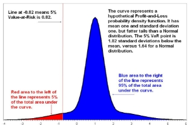

**Analysis: Fallout from JPMorgan loss may have just begun**

Thu, Jul 12 2012

By Jed Horowitz

NEW YORK (Reuters) - Jamie Dimon will do his best to put the "London Whale" trading flap behind him on Friday when JPMorgan Chase & Co reports earnings, telling Wall Street that the bank has capped losses from the bad trades and found the key risk management flaw behind the positions.

But that doesn't mean the firm is off the hot seat.

Former employees and experts outside the bank say JPMorgan may be underplaying deeper management problems. Senior executives at the bank missed multiple red flags at the group responsible for the bad trades, including high turnover among risk managers, that raise questions about how far up the chain blame should be assigned.

"One would think issues would have been escalated internally," said Leslie Rahl, managing partner of Capital Market Risk Advisors and a former derivatives head at what is now Citigroup. "If there's not more disclosure about the governance on Friday, they still have questions that need to be answered."

JPMorgan declined to comment on any aspect of ongoing investigations or on responsibility for the losses.

Dimon and his team on Friday plan to disclose more about the bad derivatives bets its Chief Investment Office made on portfolios of corporate bonds, bets likely to cost the bank $4 billion to $6 billion, according to a source. The update will come as the bank reports second-quarter results that Chief Executive Jamie Dimon said were on the whole "solidly profitable."  

Dimon has moved quickly to distance himself from the losses and determine who to blame. As part of an internal investigation, bank executives were asked to draw up lists of risk managers and other executives who bear responsibility, a source said.

JPMorgan plans to attribute the losses in large part to a flaw in the way it tracked and limited risk-taking in the CIO, the source said. Instead of limiting risks for every individual trader as is standard on Wall Street, the bank assigned limits to groups of traders, allowing individuals to take outsized positions.

Ina Drew, who ran the Chief Investment Office and was deeply trusted by Dimon, has resigned, and a number of her lieutenants have had their trading terminals revoked, sources said.

"A RIGHT TO RELY ON THEM"

Dimon testified to Congress last month that "complacency" following years of success at the CIO led him and others to miss signals about the office's money-losing trades. "This synthetic credit portfolio did earn several billion dollars of income in the three or four years before it just lost some of it," Dimon told the Senate Banking Committee on June 13.

In addition to blaming Drew for the surprise loss, Dimon went on to criticize his chief financial officer, the bank's risk managers and others in the chain of command for failing to alert him to the risk that was accumulating.

"I have a right to rely on them," he said.

Barry Zubrow, who was chief risk officer from late 2007 until this January, the period when the CIO ramped up its risk appetite in London, appears to be most vulnerable to criticism, said people inside and outside JPMorgan.

Another problem for Zubrow: his brother-in-law Irvin Goldman was top risk manager in the CIO from February until he was replaced in May. Zubrow, who now heads corporate and regulatory affairs, did not return a call for comment.

The bank's chief financial officer is Douglas Braunstein. A long-time investment banker with an expertise in mergers and acquisitions, not in trading, Braunstein has been the CFO since mid-2010.

Braunstein is scheduled to give his usual presentation when the bank posts earnings on Friday, signaling to outsiders that Dimon does not assign much blame for the losses to his CFO.

Whatever Dimon says on Friday, a host of international regulators and agencies are probing the trading mishap, including the U.S. Securities and Exchange Commission, the UK's Financial Services Authority, the FBI, the Federal Deposit Insurance Corp., the U.S. Commodity Futures Trading Commission, the U.S. Treasury's Office for the Comptroller of the Currency, and the Federal Reserve Board and Federal Reserve Bank of New York.

AN UNUSUAL STRUCTURE

Dimon established the CIO in 2005 and asked Drew to manage it. The office, which now oversees about $350 billion of cash, has an unusual mandate: it is supposed to hedge the entire bank's risk, but can also take big bets to goose profits. Few banks allow the same group to do both.

The group earned billions of dollars during the financial crisis, but there were signs of trouble. In the past six years, there have been at least five different heads of market risk management within the CIO.

"It probably was a management mistake that no one asked why people were leaving," said a former senior risk manager at the bank.

One reason for departures may have been that pay was relatively low, at least by Wall Street standards, according to two people familiar with the group. The head of market risk within a business line at JPMorgan receives $1 million to $1.5 million of annual compensation, while traders who they monitor can make multiples of that amount. (Drew was awarded $31.5 million over 2010 and 2011, but the bank is likely to try to take at least some portion of that money back.)

The risk officers at the CIO also may have felt dual loyalties, sources said. The chief executives of the business lines at JP Morgan work side-by-side with the chief risk officer in picking their departments' risk managers, several sources said. That may create conflicts in a position that demands independence.

New executives appointed in the past few weeks, including Drew's replacement, Matt Zames, have moved quickly to build a new risk management structure for the CIO and the corporate bank. Dimon, in congressional testimony on the loss, called Zames a "world class risk manager."

"When we make mistakes, we take them seriously and often are our own toughest critic," he testified last month.

Another key question for most outside observers was why the bank avoided standard Wall Street practice by allowing traders to take massive positions. One trader in the CIO took big enough positions in credit derivatives markets to earn the nickname "London Whale."

"Limit structures are usually written down, and traders come in every morning knowing how much they are allowed to buy," said one senior banker with trading and risk-management experience at JPMorgan, who asked for anonymity. "If you can drive four Mack trucks through it sideways, I don't think that's a limit structure."

Incentives for traders also are worth investigating, said one former risk manager. In Dimon's congressional testimony, he said traders in the CIO were not paid on a formula that encouraged profits over risk reduction.

A former executive, however, said traders in the CIO had incentives to swing for the fences, at least when he was in that office. Their bonuses were determined in part by their ability to outperform an internally created index of the return on a standard bank treasury portfolio. The executive said he did not know if the index was still used, and bank spokesmen declined to comment.

(Additional reporting by David Henry in New York; Editing by [Dan Wilchins](http://blogs.reuters.com/search/journalist.php?edition=us&n=dan.wilchins&), Edward Tobin, Leslie Adler)

**Value-at-Risk model masked JP Morgan $2 bln loss**

Fri, May 11 2012

By Christopher Whittall

LONDON, May 11 (IFR) - The implementation of a new Value-at-Risk model looks to have masked a US$2bn mark-to-market loss that built up in JP Morgan's chief investment office over the past few months.

JP Morgan chief executive Jamie Dimon admitted the firm will likely experience volatility in its earnings over the coming quarters as it tries to manage a synthetic credit portfolio that the CIO designed to hedge a stressed credit environment, but ended up being extremely costly for the firm.

Dimon revealed the CIO's VaR had almost doubled from an average of US$67m for the first quarter to US$129m, after scrapping the CIO's new model and revising the figures appropriately. JP Morgan has decided to revert to the methodology the CIO used to calculate VaR in 2011.

"In the first quarter we implemented a new VaR model, which we now deemed inadequate, and went back to the old one that we used for the past several years, which we deemed to be more adequate," Dimon explained on a conference call with analysts.

VaR models are used by risk managers to assess the potential future losses a portfolio could be subject to. VaR came in for heated criticism following the financial crisis as many models failed to predict the extent of the losses that devastated many large banks in 2007 and 2008.

The revelations vividly illustrate the potential for banks' internal risk models to produce vastly different results that can have real economic impacts. The case may well bring into focus once more how bank VaR models can hinder as well as aid risk management.

Dimon laid the blame for the CIO losses squarely at the feet of the trading strategy aimed at reducing the CIO's synthetic credit portfolio hedge, which he said was "flawed, complex, poorly reviewed, poorly executed and poorly monitored."

However, there seems little doubt that the new VaR model masked the losses racking up in the CIO by artificially depressing the potential risks the bank was exposed to.

The CIO's average VaR for the first quarter was US$67m under the new VaR model. This was broadly in line with the average CIO VaR for 2011of US$60m, calculated under the old model.

Scrapping the new VaR model and revising figures to be directly comparable to those reported in 2011 shows how much the new hedging strategy increased the bank's risk.

The CIO's VaR at the end of the first quarter was US$186m using the CIO's original model - more than three times bigger than its position a year ago of US$55m.

The new model may also have helped mask volatility of the CIO's new hedging strategy. The CIO's VaR was relatively stable in 2011, remaining between a minimum of US$55m and a maximum of US$64m.

JP Morgan has not detailed how VaR behaved under its new model in 2012. However, it showed that VaR swung around in a range of US$85m to US$187m during the first quarter under the old model.

Dimon declined to elaborate on the decision to switch VaR models in the CIO other than saying: "There are constant changes and updates to models; we're always trying to get them better than they were before. It's an ongoing procedure."

Commenting on the incident in general, the chief executive told analysts: "We have had many lessons learnt and we have already changed some policies and procedures as we've gone along."

|

<h2>**Investopedia explains 'Value At Risk - VaR'**</h2>

A statistical technique used to measure and quantify the level of financial risk within a firm or investment portfolio over a specific time frame. Value at risk is used by risk managers in order to measure and control the level of risk which the firm undertakes. The risk manager's job is to ensure that risks are not taken beyond the level at which the firm can absorb the losses of a probable worst outcome. 
||
| :- | :- |
||Value at Risk is measured in three variables: the amount of potential loss, the probability of that amount of loss, and the time frame. For example, a financial firm may determine that it has a 5% one month value at risk of $100 million. This means that there is a 5% chance that the firm could lose more than $100 million in any given month. Therefore, a $100 million loss should be expected to occur once every 20 months. |
||<h2></h2>|

